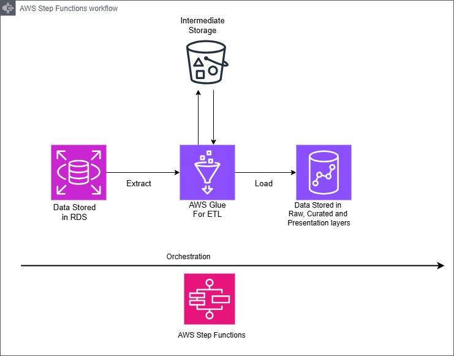
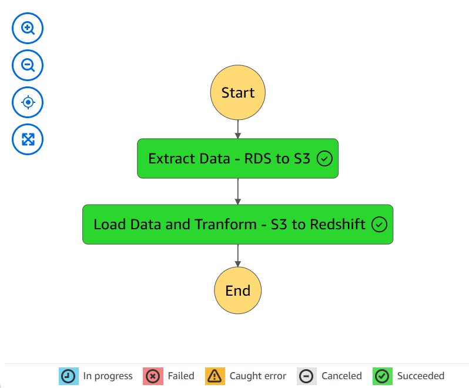

# Rental Marketplace Analytics Pipeline

## Project Overview
This project implements an end-to-end data pipeline for a rental marketplace platform, processing rental listings and user interaction data for analytical reporting. The pipeline extracts data from AWS Aurora MySQL, transforms it through multiple layers, and loads it into Amazon Redshift for business intelligence purposes.

## Architecture
### System Architecture


 *System architecture showing data flow from source systems through transformation layers to final consumption*
- **Source**: AWS RDS MySQL (Application Database)
- **Staging**: Amazon S3
- **Destination**: Amazon Redshift (Data Warehouse)
- **Processing**: AWS Glue ETL Jobs
- **Orchestration**: AWS Step Functions
- **Monitoring**: CloudWatch


## Data Flow
### ETL Pipeline Flow


 *Step Functions workflow showing the detailed ETL process and state transitions*
1. Extract: RDS MySQL → S3 (raw data)
2. Load: S3 → Redshift Raw Layer
3. Transform: Raw → Curated → Presentation Layer

## Key Components

### Source Tables
- `apartments`: Core listing information
- `apartment_attributes`: Detailed property characteristics
- `user_viewing`: User interaction data
- `bookings`: Reservation details

### ETL Jobs
1. **RDS_TO_S3_job**
   - Extracts data from RDS MySQL
   - Performs initial data validation
   - Stores data in S3 in Parquet format

2. **glue_to_redshift_job**
   - Loads data from S3 to Redshift
   - Implements data quality checks
   - Manages incremental loads

### Business Metrics
The pipeline generates the following insights:

#### Rental Performance Metrics
- Average Listing Price (weekly)
- Occupancy Rate (monthly)
- Most Popular Locations (weekly)
- Top Performing Listings (weekly revenue)

#### User Engagement Metrics
- Total Bookings per User (weekly)
- Average Booking Duration
- Repeat Customer Rate (30-day rolling window)

## Setup and Configuration

### Prerequisites
- AWS Account with appropriate permissions
- AWS CLI configured
- Python 3.8+
- AWS Services:
  - RDS MySQL
  - S3
  - Redshift
  - Glue
  - Step Functions
  - CloudWatch
  

### Installation Steps
1. Clone the repository:
   ```bash
   git clone [repository-url]
   cd rental-marketplace-analytics
   ```

2. Configure AWS resources:
   ```bash
   aws configure
   ```

3. Create S3 bucket and upload data:
   ```bash
   aws s3 mb s3://[bucket-name]
   aws s3 cp data/ s3://[bucket-name]/data/ --recursive
   ```

4. Set up Redshift schemas:
   ```bash
   psql -h [redshift-host] -U [username] -d [database] -f sql/schema_setup.sql
   ```

### Environment Variables
Create a `.env` file with the following variables:
```
REDSHIFT_HOST=your-cluster.region.redshift.amazonaws.com
REDSHIFT_DATABASE=dev
REDSHIFT_USER=admin
REDSHIFT_PASSWORD=your-password
S3_BUCKET=your-data-lake-bucket
GLUE_ROLE_ARN=arn:aws:iam::account:role/GlueETLRole
```

## Usage

### Running the Pipeline
The pipeline is automatically triggered on a schedule, but can be manually executed:

1. Via AWS Console:
   - Navigate to Step Functions
   - Select the ETL state machine
   - Click "Start Execution"

2. Via AWS CLI:
   ```bash
   aws stepfunctions start-execution --state-machine-arn [state-machine-arn]
   ```

### Monitoring
- CloudWatch Dashboard: `RentalAnalytics-Dashboard`
- Execution Logs: Available in CloudWatch Logs

## Troubleshooting

### Common Issues
1. **Data Validation Failures**
   - Check source data quality
   - Review validation logs in CloudWatch

2. **Redshift Load Errors**
   - Verify COPY command permissions
   - Check S3 bucket access

3. **Performance Issues**
   - Monitor Redshift WLM queue
   - Review Glue DPU allocation

## Development

### Adding New Metrics
1. Add SQL definition in `sql/metrics/`
2. Update transformation procedure
3. Modify presentation layer views


## Contributing
1. Fork the repository
2. Create a feature branch
3. Commit changes
4. Submit pull request

## License
This project is licensed under the MIT License.

## Contact
For questions or feedback, please reach out to charlesadunkansah@gmail.com
