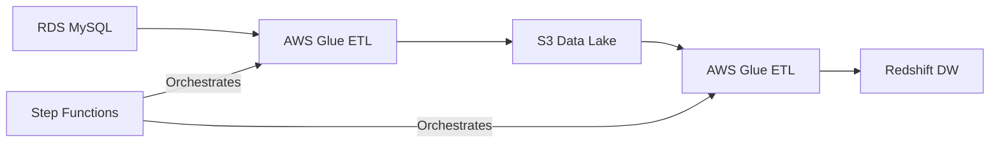

# Rental Marketplace Analytics Pipeline - Technical Documentation

## Architecture Overview


## Data Pipeline Components

### 1. Source Data Model (Aurora MySQL)
- **Apartments** (`apartments`)
  - Primary transaction table containing listing details
  - Key fields: `id`, `title`, `price`, `is_active`
  - Temporal fields: `listing_created_on`, `last_modified_timestamp`

- **Apartment Attributes** (`apartment_attributes`)
  - Dimensional data for apartment characteristics
  - Location data: `latitude`, `longitude`, `cityname`, `state`
  - Property specs: `bedrooms`, `bathrooms`, `square_feet`

- **User Interactions** (`user_viewing`)
  - User engagement tracking
  - Captures: viewing timestamps, wishlisting, call-to-actions

- **Bookings** (`bookings`)
  - Reservation transactions
  - Tracks: check-in/out dates, pricing, status

### 2. ETL Implementation

#### Extract Process (RDS to S3)
**File**: `glue_scripts/rds_to_s3_job.py`
- Implements incremental extraction using timestamp-based tracking
- Validates data completeness and schema conformity
- Partitions data by load date in S3

#### Load & Transform Process (S3 to Redshift)
**File**: `glue_scripts/s3_to_redshift_job.py`
- Implements COPY commands for efficient bulk loading
- Handles data type conversions and NULL handling
- Implements error logging and retry mechanisms

### 3. Data Warehouse Design

#### Layer Architecture
1. **Raw Layer**
   - Direct 1:1 mapping from source tables
   - No transformations, preserves source data integrity

2. **Curated Layer**
   - Cleaned and validated data
   - Business rules applied:
     - Active listings only
     - Valid location data
     - Confirmed and paid bookings

3. **Presentation Layer**
   - Business metrics computation
   - Aggregated views for reporting

#### Key Metrics Implementation
**File**: `stored_procedure.sql`

```sql
-- Example of metrics computation logic:
-- Average Listing Price Weekly
SELECT
    DATE_TRUNC('week', a.listing_created_on) AS week_start,
    aa.cityname,
    AVG(a.price) AS avg_price
FROM curated.apartments a
JOIN curated.apartment_attributes aa ON a.id = aa.id
GROUP BY 1, 2
```

### 4. Pipeline Orchestration
**File**: `step_funtion_flow.json`

```json
{
    "StartAt": "Extract Data - RDS to S3",
    "States": {
        "Extract Data - RDS to S3": {
            "Type": "Task",
            "Resource": "arn:aws:states:::glue:startJobRun.sync",
            "Parameters": {
                "JobName": "RDS_TO_S3_job"
            },
            "Next": "Load Data and Transform - S3 to Redshift"
        }
    }
}
```

## Operational Guidelines

### Monitoring & Alerting
- CloudWatch metrics for Glue job execution
- Step Functions execution status
- Data quality validation alerts

### Error Handling
1. **Extract Failures**
   - Retry mechanism in Step Functions
   - Source system availability checks
   - Data integrity validation

2. **Load Failures**
   - Partition management
   - Constraint violation handling

### Performance Optimization
1. **Glue Jobs**
   - DPU allocation: 2 workers
   - Spark configurations tuned for memory management
   - Partition pruning enabled

2. **Redshift**
   - Distribution keys on high-cardinality columns
   - Sort keys for temporal queries
   - Vacuum and analyze scheduling


## Development Guidelines

### Adding New Metrics
1. Define business requirements
2. Implement in curated layer if new transformations needed
3. Add computation logic in stored procedure
4. Update monitoring dashboards

### Code Standards
- Use meaningful variable names
- Include error handling for all operations
- Document complex SQL transformations
- Implement logging at appropriate levels


## Disaster Recovery

### Backup Strategy
- S3 versioning enabled
- Redshift automated snapshots
- Source system backup verification

### Recovery Procedures
1. Identify failure point
2. Execute relevant recovery script
3. Validate data consistency
4. Resume pipeline from last successful state